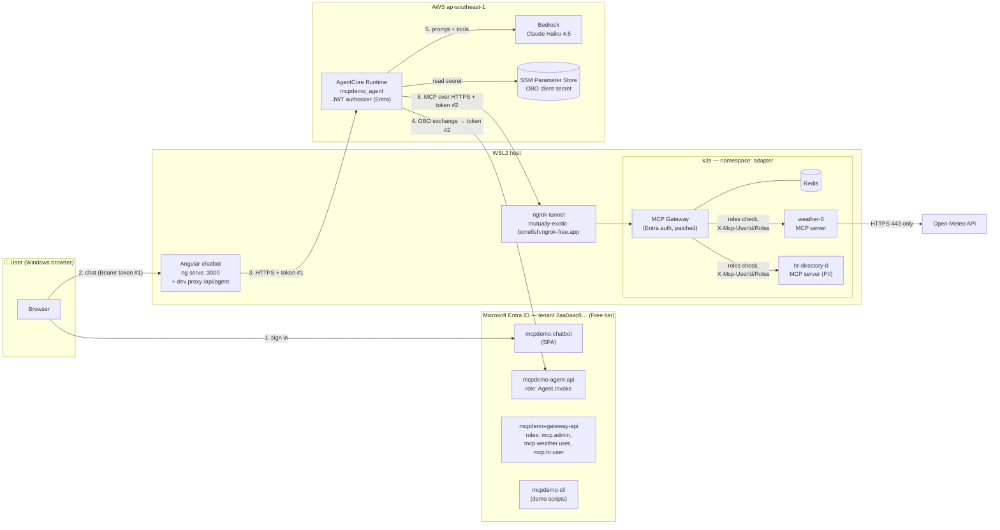
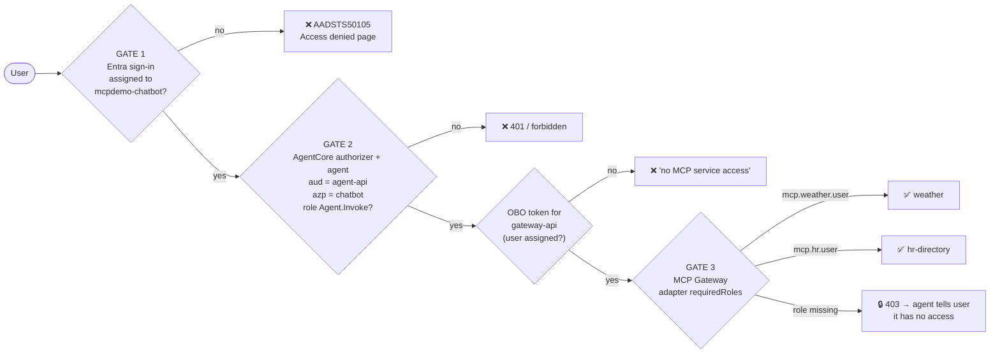
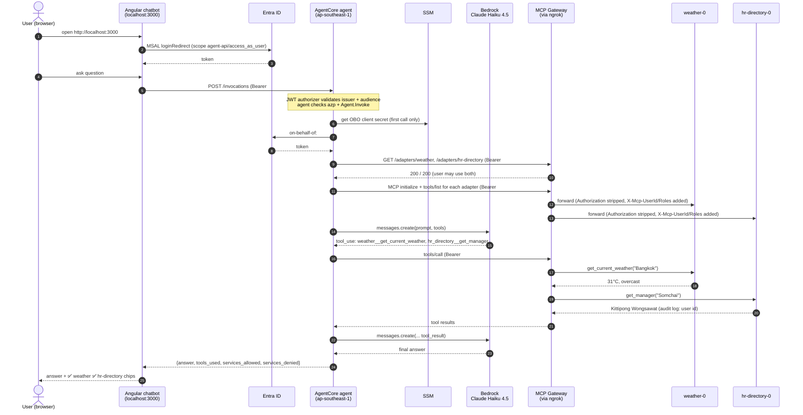
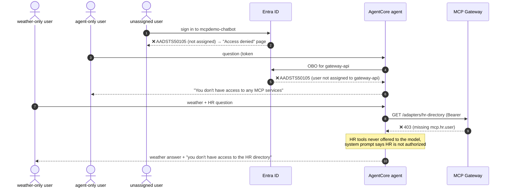
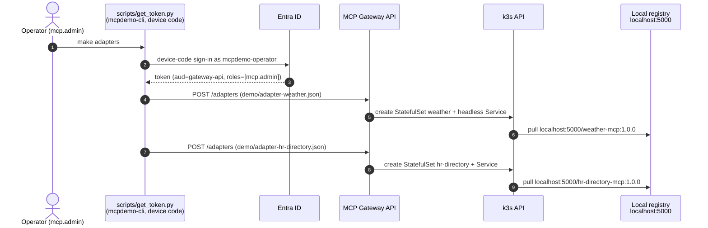
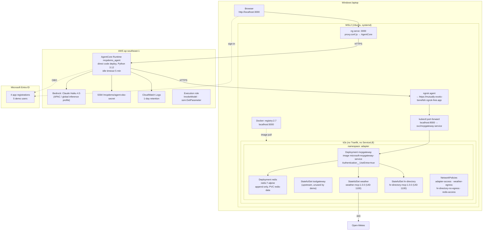

# MCP Gateway Security Demo — Architecture & User Guide

This demo shows an AI agent that answers questions using company tools (MCP servers) **only through Microsoft MCP Gateway**, always acting with the **signed-in user's own identity and permissions**.

- **Chatbot:** Angular SPA with Microsoft Entra ID sign-in (MSAL Angular), running on WSL.
- **Agent:** Python on **Amazon Bedrock AgentCore Runtime** (Singapore, `ap-southeast-1`), using **Claude Haiku 4.5** on Bedrock.
- **MCP Gateway:** Microsoft MCP Gateway on **k3s** in WSL, with Entra ID authentication.
- **MCP servers:** `weather` (public data from Open-Meteo) and `hr-directory` (fake employee data that includes PII fields).
- **Identity:** a single Entra ID tenant on the **Free** tier, with app roles assigned directly to users.

---

## 1. Architecture



### Components

| Component | Where | Role in the demo |
|---|---|---|
| Angular chatbot | WSL, `http://localhost:3000` | User interface. Signs the user in with MSAL, then calls the agent through the dev-server proxy using the agent-API token. |
| AgentCore agent | AWS `ap-southeast-1` | Validates the user's token, exchanges it on-behalf-of the user, calls Claude, and calls MCP tools through the gateway. |
| Claude Haiku 4.5 | Amazon Bedrock | Picks which tools to call and writes the answer. Chosen as the cheapest current Claude model. |
| MCP Gateway | k3s on WSL | The single entry point to all MCP servers. It authenticates Entra tokens, checks each adapter's `requiredRoles`, and deploys and routes MCP servers. |
| weather MCP server | k3s pod `weather-0` | `get_current_weather`, `get_forecast`. Requires the `mcp.weather.user` role. |
| hr-directory MCP server | k3s pod `hr-directory-0` | `lookup_employee`, `get_manager`, `list_team`. Returns **fake** PII. Requires the `mcp.hr.user` role. |
| ngrok | WSL | Publishes **only the gateway** so the agent in AWS can reach it. |
| Entra ID | Microsoft cloud | Holds the 4 app registrations and 5 demo users. Direct user role assignments act as the access policy. |

---

## 2. Security gates



| Control | How it is enforced |
|---|---|
| Only assigned users can use the chatbot | `appRoleAssignmentRequired=true` on the chatbot app in Entra |
| Only the chatbot can call the agent, and only for users with `Agent.Invoke` | AgentCore JWT authorizer (issuer and audience), plus agent code checks on `azp` and `roles` |
| Tools run with the **user's** permissions, never the agent's | The agent exchanges the user's token on-behalf-of (OBO) the user; the gateway checks the user's roles |
| Per-tool access (weather vs. HR PII) | Each gateway adapter has `requiredRoles` |
| MCP servers are reachable only through the gateway | Servers are created only via the gateway API. A NetworkPolicy admits adapter traffic only from the gateway pod. There is no Traefik, LoadBalancer or NodePort. Clients only know `GATEWAY_URL`. |
| The user's token never reaches the MCP servers | The gateway strips `Authorization` and forwards `X-Mcp-UserId` / `X-Mcp-Roles` instead |
| PII server can't leak data out of the cluster | `hr-directory` has no egress at all |
| Weather server can't reach internal systems | Its egress is DNS plus HTTPS to public IP addresses only |
| No secrets in code or git | The OBO secret goes from Entra straight into SSM (SecureString). Redis and gateway secrets are randomized at deploy time. `.env` and `.personas.local` are gitignored. |
| Public endpoint hardening | Only the gateway is exposed, in Entra mode only (dev-header auth is off). The agent's gateway URL is fixed at deploy time and never taken from the request. |

---

## 3. Request flow

### 3.1 Happy path: "What's the weather in Bangkok, and who is Somchai's manager?"



### 3.2 Denied paths



### 3.3 Operator flow: deploying MCP servers through the gateway



---

## 4. Deployment



### What gets created, and where

| Where | Resource | Created by |
|---|---|---|
| WSL | k3s, `/etc/rancher/k3s/registries.yaml` | `make k3s` |
| WSL | `registry` container, gateway and MCP images | `make images` |
| k3s `adapter` namespace | gateway, redis, toolgateway, RBAC, secrets, NetworkPolicies | `make up` |
| k3s `adapter` namespace | `weather`, `hr-directory` StatefulSets | the **gateway**, via `make adapters` |
| Entra ID | `mcpdemo-gateway-api`, `mcpdemo-agent-api`, `mcpdemo-chatbot`, `mcpdemo-cli`, users `mcpdemo-*`, role assignments, admin consent | `make entra` |
| AWS | AgentCore runtime `mcpdemo_agent`, execution role, SSM parameter, log groups, code package | `make agent` |

---

## 5. How to use the demo

### 5.1 Prerequisites (one time)

| Need | Check / fix |
|---|---|
| WSL2 with systemd | `/etc/wsl.conf` → `[boot] systemd=true`, then `wsl --shutdown` |
| Docker in WSL | `docker info` |
| Azure CLI logged in to the tenant as an admin | `az login --tenant 2aa0aac8-a644-4603-9530-36541a8e3c79 --allow-no-subscriptions` |
| AWS CLI for Singapore | `aws configure` (region `ap-southeast-1`), then `aws sts get-caller-identity` |
| Bedrock model access | Bedrock console (ap-southeast-1) → Model catalog → **Claude Haiku 4.5** → submit the **Anthropic use case details** form (one time per AWS account; active in about 15 minutes). In Singapore, Haiku 4.5 is served through the `global.` cross-region inference profile. |
| `zip` | `sudo apt-get install -y zip` (needed by AgentCore direct code deploy) |
| ngrok | `ngrok config add-authtoken <token>` (static domain `mutually-exotic-bonefish.ngrok-free.app`) |
| .NET 8, Node 22, AgentCore CLI | Installed in your home directory; `make prereqs` prints a fix for anything missing |

Run `make prereqs` to check all of these at once.

### 5.2 Set up (one time, about 20 minutes)

```bash
make k3s        # install k3s + trust the local registry        (asks for sudo)
make entra      # Entra apps, consent, 5 demo users, roles       (writes IDs to .env)
make images     # build gateway (patched) + both MCP servers     (~5 min first time)
make up         # deploy gateway in Entra mode, policies, tunnel
make adapters   # operator deploys both MCP servers via the gateway (device-code sign-in)
make agent      # deploy the agent to AgentCore in Singapore
```

**Sign-ins you'll be asked for:**
- `make adapters` and `make demo` print a device code. Open the URL in a **private browser window** and sign in as the persona shown. Passwords are in `.personas.local`.
- Tokens are cached per persona in `.run/`, so you sign in only once per persona.

**Reliability notes:** Redis keeps the gateway's registered adapters on a persistent volume, and the gateway waits for Redis at startup. Registered MCP servers therefore survive WSL, k3s and pod restarts.

Before redeploying agent changes, run `make test-agent`. It runs `agent/agent.py` locally against the real gateway, Entra, SSM and Bedrock for the `full` and `weather-only` personas.

### 5.3 Start the demo (each time)

```bash
make tunnel     # only after a reboot: port-forward + ngrok
make chat       # chatbot on http://localhost:3000 (leave running)
```

### 5.4 Demo script (about 15 minutes)

| # | Say | Do | Expected |
|---|---|---|---|
| 1 | "All MCP servers live behind one gateway." | `make demo` (steps 1–2) | Gateway, redis and toolgateway pods, plus `weather-0` and `hr-directory-0` created by the gateway |
| 2 | "No token, no access. Roles decide per server." | `make demo` (step 3 table) | no token → 401; operator → 200/200; full → 200/200; weather-only → 200 / **403** on HR |
| 3 | "You can't bypass the gateway, even from inside the cluster." | `make verify` | direct pod access blocked; no exposed services; every server is registered |
| 4 | "Full access user." | Browser (private window) → sign in as `mcpdemo-full` → *"What's the weather in Bangkok, and who is Somchai's manager?"* | Both answered; chips ✅ weather ✅ hr-directory; footnote lists tools used |
| 5 | "Tools can chain." | *"What's the weather where Somchai lives?"* | HR lookup → Chiang Mai → weather |
| 6 | "Same agent, less privilege." | Switch persona → `mcpdemo-weather-only`, same question | Weather answered, HR refused; chips ✅ weather 🔒 hr-directory |
| 7 | "The agent can't escalate." | `mcpdemo-agent-only` | "You don't have access to any MCP services" |
| 8 | "No assignment, no app." | `mcpdemo-none` | Access denied page (AADSTS50105) |
| 9 | "Revoke live, no redeploy." | `python3 scripts/entra.py revoke <full-upn> gateway:mcp.hr.user`, then sign out and back in as `mcpdemo-full`, ask again | HR now 🔒. Restore with `grant`. |
| 10 | "Who accessed the PII?" | `kubectl -n adapter logs hr-directory-0 \| grep hr-audit` | One audit line per HR tool call, with the user id and roles forwarded by the gateway |

`make demo` saves a transcript to `out/demo-run.md`.

### 5.5 Managing access

```bash
make access                                                    # show all role assignments
python3 scripts/entra.py grant  <upn> gateway:mcp.hr.user      # give HR access
python3 scripts/entra.py revoke <upn> gateway:mcp.hr.user      # remove HR access
python3 scripts/entra.py grant  <upn> chatbot:default          # allow chatbot sign-in
python3 scripts/entra.py grant  <upn> agent:Agent.Invoke       # allow using the agent
```

Changes apply the next time the user signs in, because Entra only puts roles into newly issued tokens. The persona-to-role map lives in `entra/access.json`.

### 5.6 Troubleshooting

| Symptom | Likely cause | Fix |
|---|---|---|
| `make up` ends with "gateway not reachable through ngrok" | ngrok authtoken or domain problem, or the port-forward died | Check `.run/ngrok.log` and `.run/port-forward.log`, then `make tunnel` |
| Pods stuck in `ImagePullBackOff` | k3s doesn't trust `localhost:5000` | Re-run `make k3s` (rewrites `registries.yaml`), then `make images` |
| Chatbot shows AADSTS50105 | User isn't assigned to `mcpdemo-chatbot` | `entra.py grant <upn> chatbot:default` |
| Chatbot shows AADSTS65001 (consent) | Admin consent is missing | Re-run `make entra` |
| Chat says "Request failed (401)" | AgentCore authorizer rejected the token (audience or tenant) | Check `AGENT_API_CLIENT_ID` in `.env` and re-run `make agent` |
| Agent answers "no access to any MCP services" for a full user | OBO failed (expired secret or missing consent) | `scripts/agent-deploy.sh --rotate`; check CloudWatch logs for `obo_failed` |
| Chat says "The model call failed", or the logs say "Model use case details have not been submitted" | The Anthropic use case form hasn't been submitted for the AWS account | Submit it in the Bedrock console, wait about 15 minutes. No redeploy needed. |
| Chat shows `424 Failed Dependency` | The agent code raised an error | `aws logs tail /aws/bedrock-agentcore/runtimes/<runtime-id>-DEFAULT --region ap-southeast-1 --since 15m`. Reproduce locally with `make test-agent`. |
| Service chip shows ⚠️ (unavailable) | The gateway or an adapter is down, or adapters aren't registered | `make tunnel`; check `kubectl -n adapter get pods`; `make adapters` if `GET /adapters` is empty |
| AgentCore dependency build fails with "Invalid Wheel-Version" | Corrupt local `uv` cache | The deploy script already bypasses the cache (`UV_NO_CACHE=1`); `uv cache clean` fixes it permanently |
| Tools time out | Tunnel is down (after sleep or reboot) | `make tunnel` (the port-forward re-attaches by itself when the gateway pod restarts) |

### 5.7 Teardown

```bash
make down       # stop tunnel, delete k8s namespace (keeps Entra/AWS)
make destroy    # also AgentCore runtime + SSM secret, Entra apps, k3s + registry
```

Demo users are kept by `make destroy`. Delete the `mcpdemo-*` users in the Entra admin center if you no longer need them.

---

## 6. Cost

| Item | Approximate cost |
|---|---|
| Claude Haiku 4.5 on Bedrock | ~$0.005 per question |
| AgentCore Runtime | < $0.002 per question, $0 when idle |
| Logs and code package | a few cents per month |
| k3s, gateway, MCP servers, chatbot, ngrok (free plan), Entra ID Free | $0 |

A demo day with about 100 questions comes to roughly **$0.60–1.00**. After `make destroy` the cost is $0.

Open-Meteo is free for non-commercial use only. Set `"WEATHER_MOCK": "1"` in `demo/adapter-weather.json` if that applies to your demo.

---

## 7. Repository map

| Path | What it is |
|---|---|
| `mcp-gateway/` | Upstream Microsoft MCP Gateway (git submodule, unmodified) |
| `patches/0001-entra-auth-in-development.patch` | Lets the gateway use Entra auth while keeping local Redis storage; applied at build time |
| `servers/weather-mcp/`, `servers/hr-directory-mcp/` | The two MCP servers (FastMCP, streamable HTTP :8000) |
| `demo/adapter-*.json` | Gateway registration payloads, including `requiredRoles` |
| `deployment/` | Gateway Entra patch template and NetworkPolicies |
| `agent/agent.py` | AgentCore agent: token checks, OBO, MCP client, Claude tool loop |
| `chatbot/` | Angular SPA with MSAL Angular; `proxy.conf.js` forwards to AgentCore |
| `entra/access.json` | Persona → role assignments |
| `scripts/` | Setup, deploy, demo, verify and teardown scripts (`make help`) |
