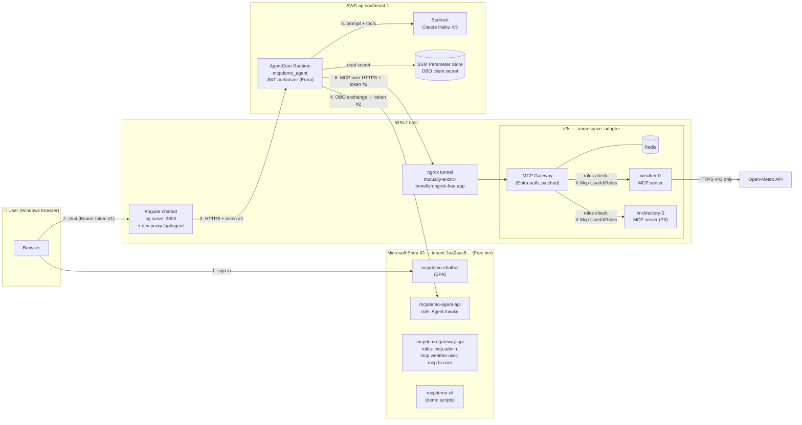
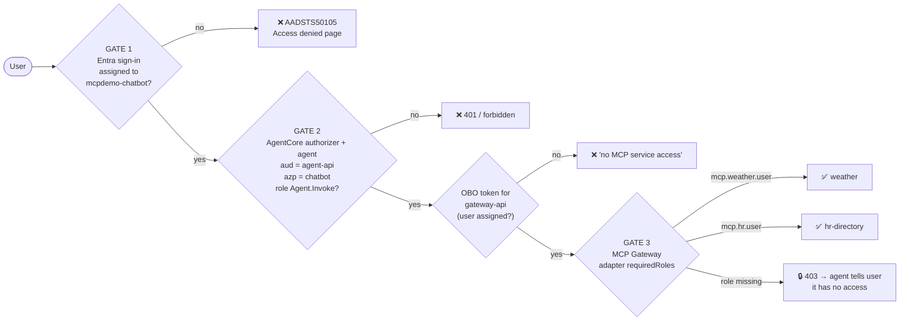
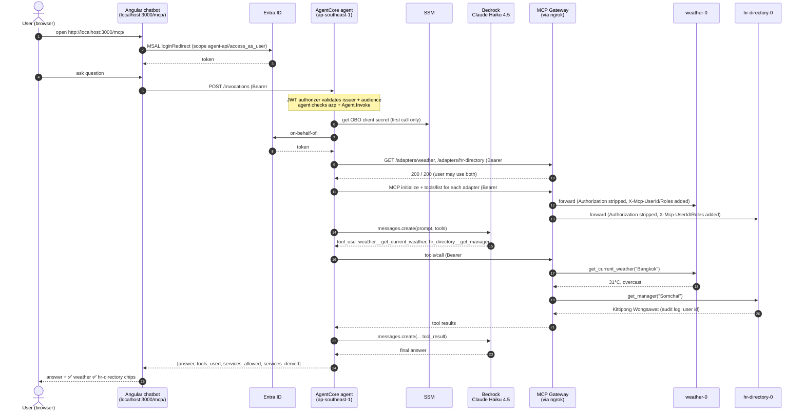
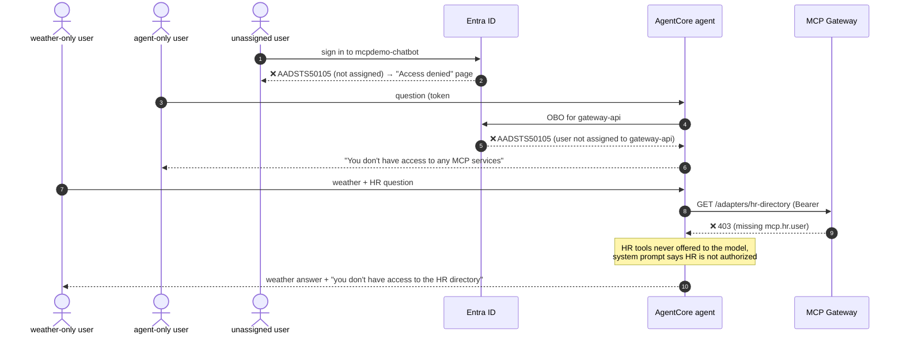
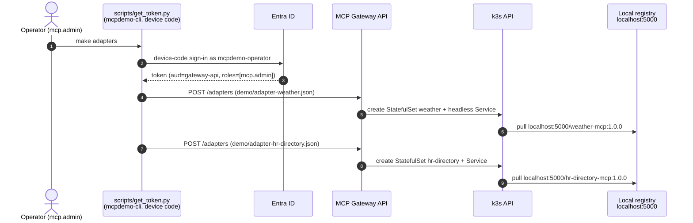
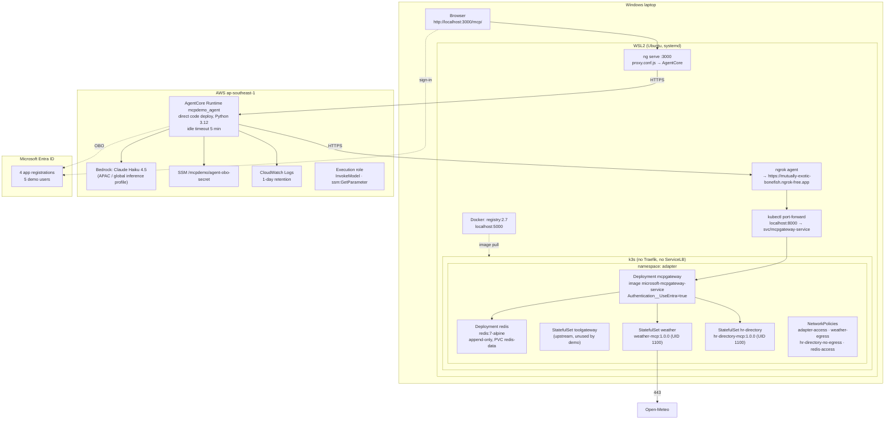
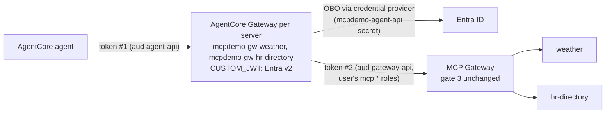

# MCP Gateway Security Demo — Architecture & User Guide

This demo shows an AI agent that answers questions using company tools (MCP servers) **only through Microsoft MCP Gateway**, always acting with the **signed-in user's own identity and permissions**.

- **Chatbot:** Angular SPA with Microsoft Entra ID sign-in (MSAL Angular), running on WSL.
- **Agent:** Python on **Amazon Bedrock AgentCore Runtime** (Singapore, `ap-southeast-1`), using **Claude Haiku 4.5** on Bedrock.
- **MCP Gateway:** Microsoft MCP Gateway on **k3s** in WSL, with Entra ID authentication.
- **MCP servers:** `weather` (public data from Open-Meteo) and `hr-directory` (fake employee data that includes PII fields).
- **Identity:** a single Entra ID tenant on the **Free** tier, with app roles assigned directly to users.

---

## 1. Architecture



### Components

| Component | Where | Role in the demo |
|---|---|---|
| Angular chatbot | WSL, `http://localhost:3000/mcp/` | User interface. Signs the user in with MSAL, then calls the agent through the dev-server proxy using the agent-API token. |
| AgentCore agent | AWS `ap-southeast-1` | Validates the user's token, exchanges it on-behalf-of the user, calls Claude, and calls MCP tools through the gateway. |
| Claude Haiku 4.5 | Amazon Bedrock | Picks which tools to call and writes the answer. Chosen as the cheapest current Claude model. |
| MCP Gateway | k3s on WSL | The single entry point to all MCP servers. It authenticates Entra tokens, checks each adapter's `requiredRoles`, and deploys and routes MCP servers. |
| weather MCP server | k3s pod `weather-0` | `get_current_weather`, `get_forecast`. Requires the `mcp.weather.user` role. |
| hr-directory MCP server | k3s pod `hr-directory-0` | `lookup_employee`, `get_manager`, `list_team`. Returns **fake** PII. Requires the `mcp.hr.user` role. |
| ngrok | WSL | Publishes **only the gateway** so the agent in AWS can reach it. |
| Entra ID | Microsoft cloud | Holds the 4 app registrations and 5 demo users. Direct user role assignments act as the access policy. |

---

## 2. Security gates



| Control | How it is enforced |
|---|---|
| Only assigned users can use the chatbot | `appRoleAssignmentRequired=true` on the chatbot app in Entra |
| Only the chatbot can call the agent, and only for users with `Agent.Invoke` | AgentCore JWT authorizer (issuer and audience), plus agent code checks on `azp` and `roles` |
| Tools run with the **user's** permissions, never the agent's | The agent exchanges the user's token on-behalf-of (OBO) the user; the gateway checks the user's roles |
| Per-tool access (weather vs. HR PII) | Each gateway adapter has `requiredRoles` |
| MCP servers are reachable only through the gateway | Servers are created only via the gateway API. A NetworkPolicy admits adapter traffic only from the gateway pod. There is no Traefik, LoadBalancer or NodePort. Clients only know `GATEWAY_URL`. |
| The user's token never reaches the MCP servers | The gateway strips `Authorization` and forwards `X-Mcp-UserId` / `X-Mcp-Roles` instead |
| PII server can't leak data out of the cluster | `hr-directory` has no egress at all |
| Weather server can't reach internal systems | Its egress is DNS plus HTTPS to public IP addresses only |
| No secrets in code or git | The OBO secret goes from Entra straight into SSM (SecureString). Redis and gateway secrets are randomized at deploy time. `.env` and `.personas.local` are gitignored. |
| Public endpoint hardening | Only the gateway is exposed, in Entra mode only (dev-header auth is off). The agent's gateway URL is fixed at deploy time and never taken from the request. |

---

## 3. Request flow

### 3.1 Happy path: "What's the weather in Bangkok, and who is Somchai's manager?"



### 3.2 Denied paths



### 3.3 Operator flow: deploying MCP servers through the gateway



---

## 4. Deployment



### What gets created, and where

| Where | Resource | Created by |
|---|---|---|
| WSL | k3s, `/etc/rancher/k3s/registries.yaml` | `make k3s` |
| WSL | `registry` container, gateway and MCP images | `make images` |
| k3s `adapter` namespace | gateway, redis, toolgateway, RBAC, secrets, NetworkPolicies | `make up` |
| k3s `adapter` namespace | `weather`, `hr-directory` StatefulSets | the **gateway**, via `make adapters` |
| Entra ID | `mcpdemo-gateway-api`, `mcpdemo-agent-api`, `mcpdemo-chatbot`, `mcpdemo-cli`, users `mcpdemo-*`, role assignments, admin consent | `make entra` |
| AWS | AgentCore runtime `mcpdemo_agent`, execution role, SSM parameter, log groups, code package | `make agent` |

---

## 5. How to use the demo

### 5.1 Prerequisites (one time)

| Need | Check / fix |
|---|---|
| WSL2 with systemd | `/etc/wsl.conf` → `[boot] systemd=true`, then `wsl --shutdown` |
| Docker in WSL | `docker info` |
| Azure CLI logged in to the tenant as an admin | `az login --tenant 2aa0aac8-a644-4603-9530-36541a8e3c79 --allow-no-subscriptions` |
| AWS CLI for Singapore | `aws configure` (region `ap-southeast-1`), then `aws sts get-caller-identity` |
| Bedrock model access | Bedrock console (ap-southeast-1) → Model catalog → **Claude Haiku 4.5** → submit the **Anthropic use case details** form (one time per AWS account; active in about 15 minutes). In Singapore, Haiku 4.5 is served through the `global.` cross-region inference profile. |
| `zip` | `sudo apt-get install -y zip` (needed by AgentCore direct code deploy) |
| ngrok | `ngrok config add-authtoken <token>` (static domain `mutually-exotic-bonefish.ngrok-free.app`) |
| .NET 8, Node 22, AgentCore CLI | Installed in your home directory; `make prereqs` prints a fix for anything missing |

Run `make prereqs` to check all of these at once.

### 5.2 Set up (one time, about 20 minutes)

```bash
make k3s        # install k3s + trust the local registry        (asks for sudo)
make entra      # Entra apps, consent, 5 demo users, roles       (writes IDs to .env)
make images     # build gateway (patched) + both MCP servers     (~5 min first time)
make up         # deploy gateway in Entra mode, policies, tunnel
make adapters   # operator deploys both MCP servers via the gateway (device-code sign-in)
make agent      # deploy the agent to AgentCore in Singapore
```

**Sign-ins you'll be asked for:**
- `make adapters` and `make demo` print a device code. Open the URL in a **private browser window** and sign in as the persona shown. Passwords are in `.personas.local`.
- Tokens are cached per persona in `.run/`, so you sign in only once per persona.

**Reliability notes:** Redis keeps the gateway's registered adapters on a persistent volume, and the gateway waits for Redis at startup. Registered MCP servers therefore survive WSL, k3s and pod restarts.

Before redeploying agent changes, run `make test-agent`. It runs `agent/agent.py` locally against the real gateway, Entra, SSM and Bedrock for the `full` and `weather-only` personas.

### 5.3 Start the demo (each time)

```bash
make tunnel     # only after a reboot: port-forward + ngrok
make chat       # chatbot on http://localhost:3000/mcp/ (leave running)
```

### 5.4 Demo script (about 15 minutes)

| # | Say | Do | Expected |
|---|---|---|---|
| 1 | "All MCP servers live behind one gateway." | `make demo` (steps 1–2) | Gateway, redis and toolgateway pods, plus `weather-0` and `hr-directory-0` created by the gateway |
| 2 | "No token, no access. Roles decide per server." | `make demo` (step 3 table) | no token → 401; operator → 200/200; full → 200/200; weather-only → 200 / **403** on HR |
| 3 | "You can't bypass the gateway, even from inside the cluster." | `make verify` | direct pod access blocked; no exposed services; every server is registered |
| 4 | "Full access user. Watch the traffic." | Browser (private window) → sign in as `mcpdemo-full` → *"What's the weather in Bangkok, and who is Somchai's manager?"* | Traffic panel lights up live: chatbot → Entra → agent → Entra (OBO) → gateway → **both** MCP servers, plus Bedrock turns. Both answered; chips ✅ weather ✅ hr-directory |
| 5 | "Tools can chain." | *"What's the weather where Somchai lives?"* | HR lookup → Chiang Mai → weather |
| 6 | "Same agent, less privilege: the gateway says no." | Switch persona → `mcpdemo-weather-only`, same question | In the panel, the gateway → hr-directory edge turns **red ✖ "403 blocked at gateway"**, while weather flows through. Weather answered, HR refused; chips ✅ weather 🔒 hr-directory |
| 6b | "The MCP server never sees the user's token." | Click the `tools/call get_current_weather` step in the log | *"weather-0 received the call from the gateway as user … with roles [mcp.weather.user]. Authorization header received: **no (stripped by gateway)**"* |
| 7 | "The agent can't escalate." | `mcpdemo-agent-only` | "You don't have access to any MCP services" |
| 8 | "No assignment, no app." | `mcpdemo-none` | Access denied page (AADSTS50105) |
| 9 | "Revoke live, no redeploy." | `python3 scripts/entra.py revoke <full-upn> gateway:mcp.hr.user`, then sign out and back in as `mcpdemo-full`, ask again | HR now 🔒. Restore with `grant`. |
| 10 | "Who accessed the PII?" | `kubectl -n adapter logs hr-directory-0 \| grep hr-audit` | One audit line per HR tool call, with the user id and roles forwarded by the gateway |

`make demo` saves a transcript to `out/demo-run.md`.

### 5.4a Live traffic panel

The right-hand side of the chatbot shows every request as it happens. The agent streams one event per step, and each step lights up the matching edge:

| Edge | What travels over it |
|---|---|
| Chatbot → Entra ID | The browser gets token #1 for the agent API (MSAL, usually from its cache) |
| Chatbot → AgentCore agent | `POST /invocations` with token #1. The step shows the token's claims: aud, azp, roles |
| AgentCore agent → Entra ID | The on-behalf-of exchange for token #2 (gateway API). The step shows the user's gateway roles |
| AgentCore agent → Bedrock | One `messages.create` per model turn. The step shows the tools Claude asked for and the token counts |
| AgentCore agent → MCP Gateway | `GET /adapters/<name>` permission checks (200, or **403 denied**), MCP `initialize`/`tools/list`, and `tools/call` |
| MCP Gateway → weather / hr-directory | Traffic the gateway forwarded to an MCP server. A denied check leaves this edge **red ✖** and marks the server "403 blocked at gateway" |

**AgentCore Gateway mode** (`TOOLS_VIA=agentcore-gateway`, §5.8): an **AgentCore Gateways** node sits between the agent and the MCP Gateway, with an edge to Entra ID for the on-behalf-of exchange it now performs. The agent's steps go to that node, one `MCP initialize + tools/list` per server; a server the user may not use is answered with an authorization error, shown as **denied** with the server marked "403 blocked at gateway".

**Colours:** blue with a moving dot means the call is in flight; green means OK (the small number counts calls); red means denied; amber means error. Click any step in the log to see its details.

For `tools/call` steps, the log also shows what the **MCP server itself** reported receiving from the gateway: its pod name, the user id and roles the gateway forwarded, and that no `Authorization` header arrived. **Replay** re-animates the selected answer, and clicking an earlier answer in the chat shows its traffic.

**Request / Response.** Opening a step shows its HTTP exchange(s): method and URL, a few headers (`content-type`, `accept`, MCP and AgentCore session headers), the body, the response status and the response body. `POST /invocations` shows both legs: what the browser sent and what the agent received. Calls made by libraries rather than raw HTTP — MSAL's token requests and Bedrock's SigV4-signed `invoke` — are described from their inputs and outputs. `Authorization` is always shown as `Bearer <token #1>` / `<token #2>` (or "AWS4-HMAC-SHA256 (agent execution role)"), next to that token's whitelisted claims.

**Agent platform switch.** The chat bar has an *Agent platform* toggle — **AgentCore** (the AgentCore runtime runs the
Claude loop itself) or **Bedrock Agent** (the Bedrock Agent `mcpdemo-tools-agent` plans and picks tools; the AgentCore
runtime runs each tool with the user's token). The choice is sent with each question (`{"prompt", "engine"}`), so
both can be compared without redeploying; the default comes from `AGENT_ENGINE`. Each answer is labelled with the
platform it ran on, and the diagram follows the selected answer: Bedrock node = *Bedrock / Claude Haiku 4.5* with
`messages.create` steps, or *Bedrock Agent / agent platform* with `InvokeAgent` steps (agent node = *tool runner*).

**Who each node acts as.** Every node has an `as:` line (full identity on hover): the chatbot acts as the signed-in user; the agent as its IAM execution role, for that user; the AgentCore Gateways as `mcpdemo-agentcore-gateway-role`, exchanging the user's token (OBO); the MCP Gateway as the Entra app `mcpdemo-gateway-api`; the MCP servers as the user id and roles the MCP Gateway forwarded on the latest tool call. The chat column takes 1/3 of the screen and the traffic panel 2/3 (single column below 1100px).

The panel never shows tokens or secrets. It shows only whitelisted claims (`aud`, `azp`, `roles`, `scp`, `preferred_username`) and tool arguments and results cut to 300 characters.

### 5.5 Managing access

```bash
make access                                                    # show all role assignments
python3 scripts/entra.py grant  <upn> gateway:mcp.hr.user      # give HR access
python3 scripts/entra.py revoke <upn> gateway:mcp.hr.user      # remove HR access
python3 scripts/entra.py grant  <upn> chatbot:default          # allow chatbot sign-in
python3 scripts/entra.py grant  <upn> agent:Agent.Invoke       # allow using the agent
```

Changes apply the next time the user signs in, because Entra only puts roles into newly issued tokens. The persona-to-role map lives in `entra/access.json`.

### 5.6 Troubleshooting

| Symptom | Likely cause | Fix |
|---|---|---|
| `make up` ends with "gateway not reachable through ngrok" | ngrok authtoken or domain problem, or the port-forward died | Check `.run/ngrok.log` and `.run/port-forward.log`, then `make tunnel` |
| Pods stuck in `ImagePullBackOff` | k3s doesn't trust `localhost:5000` | Re-run `make k3s` (rewrites `registries.yaml`), then `make images` |
| Chatbot shows AADSTS50105 | User isn't assigned to `mcpdemo-chatbot` | `entra.py grant <upn> chatbot:default` |
| Chatbot shows AADSTS65001 (consent) | Admin consent is missing | Re-run `make entra` |
| Chat says "Request failed (401)" | AgentCore authorizer rejected the token (audience or tenant) | Check `AGENT_API_CLIENT_ID` in `.env` and re-run `make agent` |
| Agent answers "no access to any MCP services" for a full user | OBO failed (expired secret or missing consent) | `scripts/agent-deploy.sh --rotate`; check CloudWatch logs for `obo_failed` |
| Chat says "The model call failed", or the logs say "Model use case details have not been submitted" | The Anthropic use case form hasn't been submitted for the AWS account | Submit it in the Bedrock console, wait about 15 minutes. No redeploy needed. |
| Chat shows `424 Failed Dependency` | The agent code raised an error | `aws logs tail /aws/bedrock-agentcore/runtimes/<runtime-id>-DEFAULT --region ap-southeast-1 --since 15m`. Reproduce locally with `make test-agent`. |
| Service chip shows ⚠️ (unavailable) | The gateway or an adapter is down, or adapters aren't registered | `make tunnel`; check `kubectl -n adapter get pods`; `make adapters` if `GET /adapters` is empty |
| AgentCore dependency build fails with "Invalid Wheel-Version" | Corrupt local `uv` cache | The deploy script already bypasses the cache (`UV_NO_CACHE=1`); `uv cache clean` fixes it permanently |
| Tools time out | Tunnel is down (after sleep or reboot) | `make tunnel` (the port-forward re-attaches by itself when the gateway pod restarts) |

### 5.7 Teardown

```bash
make down       # stop tunnel, delete k8s namespace (keeps Entra/AWS)
make destroy    # also AgentCore runtime + AgentCore Gateway (if any) + SSM secret, Entra apps, k3s + registry
```

Demo users are kept by `make destroy`. Delete the `mcpdemo-*` users in the Entra admin center if you no longer need them.

### 5.8 AgentCore Gateway mode

Puts AWS Bedrock AgentCore Gateways (one per MCP server) between the agent and the MCP Gateway, so the tools are visible to AWS
and to governance tools that discover AgentCore gateways and their MCP targets (for example SailPoint Agentic
Fabric's AWS SaaS connector).



| | Direct (default) | AgentCore Gateway mode |
|---|---|---|
| Who does the OBO exchange | the agent (MSAL, secret from SSM) | the AgentCore Gateway's Entra credential provider (same app and secret) |
| What the agent sends | token #2 to the MCP Gateway | token #1 to each server's AgentCore Gateway |
| Per-adapter access decision | agent probes `GET /adapters/<name>` | each gateway lists tools per user (`DYNAMIC` listing); a refused listing (authorization error = the MCP Gateway's 403) is denied |
| Gate 3 (requiredRoles), header stripping, HR audit | MCP Gateway | unchanged: still the MCP Gateway, with the user's token |

Set up and switch:

```bash
make agentcore-gw                         # scripts/agentcore-gateway.sh: provider, role, a gateway + target per server
TOOLS_VIA=agentcore-gateway make test-agent   # test locally first
TOOLS_VIA=agentcore-gateway make agent    # redeploy the agent on the new route (remembered in .env)
TOOLS_VIA=mcp-gateway make agent          # back to the direct route
```

What `scripts/agentcore-gateway.sh` creates (ap-southeast-1):

- OAuth2 credential provider `mcpdemo-entra-obo` (vendor Microsoft, client = `mcpdemo-agent-api`, secret copied from
  SSM `/mcpdemo/agent-obo-secret` — rerun the script after rotating that secret).
- IAM role `mcpdemo-agentcore-gateway-role`, assumable only by AgentCore for the `mcpdemo-gw-*` gateways, allowed to
  fetch workload and OAuth tokens and read the provider's secret.
- Gateways `mcpdemo-gw-weather` and `mcpdemo-gw-hr-directory` (MCP, inbound CUSTOM_JWT on the Entra v2 issuer,
  audience `mcpdemo-agent-api`), tagged with the agent runtime ARN. Their URLs go to `AGENTCORE_GATEWAY_URLS` in `.env`.
- One MCP server target per gateway, named after the server, pointing at `https://$NGROK_DOMAIN/mcp/gw/adapters/<name>/mcp`
  with OAuth `TOKEN_EXCHANGE` to `api://<gateway-api>/access_as_user`. Listing is `DYNAMIC` because the default
  background sync uses an app-only token, which the MCP Gateway rejects (its roles are user roles).

**Inbound gateway in front of the agent.** The script also creates `mcpdemo-gw-agent`, a gateway *without* a
protocol type (AgentCore Runtime targets can't sit on MCP gateways) with one target, `mcpdemo-agent`
(`http.agentcoreRuntime` → the `mcpdemo_agent` runtime, `DEFAULT` endpoint), and writes its URL to
`AGENT_GATEWAY_URL`. Set `AGENT_VIA=agentcore-gateway` in `.env` and restart `make chat`: the dev-server proxy then
sends `/api/agent` to `AGENT_GATEWAY_URL/invocations`. Outbound auth is token passthrough — the gateway validates
token #1 (same Entra issuer and audience) and forwards it unchanged, so gate 2 (runtime JWT authorizer + the agent's
`azp`/`Agent.Invoke` checks) is unchanged; requests and SSE responses are forwarded as-is. A rejected token shows as
a denial on the chatbot → AgentCore Gateway edge; a denial by the agent shows on AgentCore Gateway → agent.
The runtime can still be called directly too; AWS supports restricting a JWT runtime to its gateway
(`allowedWorkloadConfiguration` on the runtime's authorizer), which this demo does not set.

**Bedrock Agent engine (`AGENT_ENGINE=bedrock-agent`).** `make bedrock-agent` creates `mcpdemo-tools-agent`
(Claude Haiku 4.5, role `mcpdemo-tools-agent-role`, alias `live`) with one action group per MCP server —
`weather-mcp`, `hr-directory-mcp`, functions generated from the servers' source — all **RETURN_CONTROL**. mcpdemo_agent
lists each server's tools through its AgentCore Gateway as before (so access is still decided per user), then calls
`InvokeAgent`; when the Bedrock Agent picks a tool it returns the call instead of running a Lambda, mcpdemo_agent runs
it with the user's token, and sends the result back in the next `InvokeAgent` (`returnControlInvocationResults`).
A service the user may not use is answered "no access" without calling it. The traffic panel shows the Bedrock node as
**Bedrock Agent** with one `InvokeAgent (turn N)` step per round. SailPoint (AWS Bedrock dataset) lists the action
groups as the agent's **Tools** — which it does not do for AgentCore runtimes.

**Declared tools.** The script also declares, in AWS, which MCP servers and tools the agent uses — read from the
servers' source by `scripts/agent_capabilities.py`, so it can't drift from the deployed tools:
- the inbound target `mcpdemo-agent` gets an OpenAPI schema for `/invocations` whose description and `x-mcp-servers`
  section list each server, its AgentCore Gateway ARN and its tools (`get-gateway-target` shows it);
- the agent runtime is tagged `mcp:servers`, `mcp:tools` and `mcp:gateways`; each MCP gateway is tagged `mcp:server`
  and `mcp:tools`.
These are declarations for governance and inventory; what a given user can actually call is still decided per
request by the MCP Gateway's roles.

Why one gateway per server: a gateway with several targets returns `tools/list` one target per page, ordered by
(random) target id, and answers a target the user may not use with an error that has no next-page cursor — so one
denied server would hide every server listed after it. With one target per gateway, each server's access decision
stands on its own.

Notes:

- The MCP Gateway and tunnel must be up (`make tunnel`) for tool calls; the AgentCore resources can be created while
  they are down.
- The MCP servers are still reachable only through the MCP Gateway; `make verify` is unchanged.
- `scripts/agentcore-gateway.sh --delete` removes everything it created; `make destroy` calls it.

---

## 6. Cost

| Item | Approximate cost |
|---|---|
| Claude Haiku 4.5 on Bedrock | ~$0.005 per question |
| AgentCore Runtime | < $0.002 per question, $0 when idle |
| Logs and code package | a few cents per month |
| k3s, gateway, MCP servers, chatbot, ngrok (free plan), Entra ID Free | $0 |

A demo day with about 100 questions comes to roughly **$0.60–1.00**. After `make destroy` the cost is $0.

Open-Meteo is free for non-commercial use only. Set `"WEATHER_MOCK": "1"` in `demo/adapter-weather.json` if that applies to your demo.

---

## 7. Repository map

| Path | What it is |
|---|---|
| `mcp-gateway/` | Upstream Microsoft MCP Gateway (git submodule, unmodified) |
| `patches/0001-entra-auth-in-development.patch` | Lets the gateway use Entra auth while keeping local Redis storage; applied at build time |
| `servers/weather-mcp/`, `servers/hr-directory-mcp/` | The two MCP servers (FastMCP, streamable HTTP :8000) |
| `demo/adapter-*.json` | Gateway registration payloads, including `requiredRoles` |
| `deployment/` | Gateway Entra patch template and NetworkPolicies |
| `agent/agent.py` | AgentCore agent: token checks, OBO, MCP client, Claude tool loop |
| `chatbot/` | Angular SPA with MSAL Angular; `proxy.conf.js` forwards to AgentCore |
| `entra/access.json` | Persona → role assignments |
| `scripts/` | Setup, deploy, demo, verify and teardown scripts (`make help`) |
| `onboarding/` | ISC Onboarding Agent: web, API, agent, connector catalog, deploy scripts (§8) |

---

## 8. ISC Onboarding Agent

A separate app in [`onboarding/`](../onboarding/README.md): an IAM engineer and an application owner onboard an
application into SailPoint ISC in one live chat. A Claude Haiku agent does the SailPoint side on the IAM engineer's
order and only ever gives the application owner instructions. Spec, plan and tasks:
[`specs/001-isc-onboarding-agent/`](../specs/001-isc-onboarding-agent/).

### 8.1 Where it runs

```
Browser ─► ngrok /onboarding/ ─► mcpdemo-edge ─► :8091 port-forward ─► onboarding-api (one container:
                                                                         │ /onboarding/ web build, /onboarding/api/)
                                                                         ▼
                              local cluster, namespace onboarding:   onboarding-api ─► MongoDB (StatefulSet + PVC)
                                                                         │ SigV4 InvokeAgentRuntime (IAM user onboarding-api)
                                                                         ▼
                              AWS ap-southeast-1:   AgentCore runtime isc_onboarding_agent (Claude Haiku 4.5)
                                                     │ ISC token per tenant from AgentCore Identity (onboarding-isc-<tenant>)
                                                     ▼
                                                   SailPoint ISC tenant API
```

All user data (accounts, transcripts, screenshots, action records) stays in MongoDB on the local cluster. The agent
is stateless: the API sends it one turn with the history it needs. Tenant credentials go straight from the admin
form into AgentCore Identity and are never stored locally.

### 8.2 Deploy (one time)

Prerequisites: the cluster from §5.2 (Docker Desktop Kubernetes on macOS, or k3s), the local registry, AWS CLI
credentials for the account, the `agentcore` CLI, and `uv`.

```bash
make onboarding-agent        # AgentCore runtime + execution-role policy + IAM user onboarding-api;
                             # its access key is written straight into Secret onboarding/onboarding-aws
make onboarding-images       # onboarding-api (API + web build) into localhost:5000
make onboarding-up           # MongoDB, the app, network policies, port-forward :8091, edge reload
make onboarding-bootstrap    # first admin account (an IAM engineer with the admin flag); password prompted
```

`make onboarding-agent` creates AWS resources (the runtime, an IAM user and an access key). Run it once; rerun it
after changing anything under `onboarding/agent/` or `onboarding/catalog/`.

Then open `https://<ngrok domain>/onboarding/`, sign in as the admin, and under **Admin**:

1. **Tenants → Register:** tenant name, API host (`<tenant>.api.identitynow-demo.com`), and a SailPoint personal
   access token (client ID and secret). The API checks it against the tenant, reads the tenant's External ID, and
   stores the token in AgentCore Identity. **Check now** re-runs the check through the agent.
2. **Accounts:** create the IAM engineers and application owners (local accounts, 12+ character passwords).

The ngrok traffic policy must send `/onboarding` to the edge. `make tunnel` writes a policy that does. If the live
`.run/ngrok-mcpdemo.yml` was edited by hand to share the domain with another project, add the `/onboarding` rule
there instead of rerunning `make tunnel`.

### 8.3 Demo script (about 10 minutes)

| Step | Who | What to show |
|---|---|---|
| 1 | IAM engineer | **Catalog**: AWS SaaS available, the planned types listed. **Start a session**: tenant, application owner, source name, management account, member accounts, regions. |
| 2 | Application owner | Opens the session from **Sessions**. The **Plan** panel shows every step of the onboarding with who does it and "x of y done" (the same on both screens), with a **Your next step** card. The owner sees **only their own thread**; the IAM engineer's thread sits in a collapsed bar ("IAM engineer ↔ Agent (hidden) · Show") they can open, view only. Picks the suggestion "What do I need to set up in AWS first?" The agent answers in the owner's thread with copy-ready AWS CLI steps, values filled in (External ID, role name, account IDs), and marks step 1 in progress in the plan. |
| 3 | Application owner | Asks the agent to create the connector. It declines: only the IAM engineer orders SailPoint changes. Pasting an `AKIA…` key shows it masked on both screens. Suggestions never offer the owner a SailPoint order. |
| 4 | IAM engineer | The IAM engineer's screen shows both threads side by side, **in step by time**: scrolling one brings the other to the same moment, with the same minute dividers ("Sync by time" turns it off). Picks "Create the connector and run the checks". The plan and the status chips update live on both screens; **SailPoint actions** records each change with its one-line outcome; **click a row** for the request the agent sent, SailPoint's response and the agent's diagnosis. |
| 5 | Both | Write while the agent is busy: the agent's reply appears at once with a **status** ("Received. I'm finishing …'s question first; yours is next"), which the answer then replaces in place; nothing is ever just "queued". If the trust is wrong, the connection check fails: the diagnosis (**Side: AWS**) is in the IAM engineer's thread, the read-only check and then the fix go to the owner **in the owner's thread** with a **relay note** for the IAM engineer, and the plan gains a "Fix the role's trust" step for the owner with the later checks **blocked**. An amber **waiting banner** names who the agent waits for and what to do; it is information only. Each thread scrolls in its own area with a **New messages** button. Screenshots that show secrets are held for the uploader only. |
| 6 | Application owner | Picks "Done, I applied the fix". The checks rerun **without a new order**: the IAM engineer's order stands, and the action records name the IAM engineer as "rerun after the application owner confirmed a fix". The results land in the IAM engineer's thread with a note in the owner's. |
| 7 | IAM engineer | Aggregation and Test Connection pass; the plan shows what is left (the CloudTrail confirmation). **Finish** the session: both screens become read-only and say an admin can reopen it. |
| 8 | Admin | **Admin → Sessions** lists every session. **Reopen** the finished one (both can write again; a note in both threads), or **Hand over** a place to another person with the same role: the previous person is taken out of the session at once, the new one sees the full history and the plan. |

#### Microsoft Entra ID (spec 002, about 8 minutes)

| Step | Who | What to show |
|---|---|---|
| 1 | IAM engineer | **Catalog**: Microsoft Entra ID is available, with its capability chips (provisioning marked "writes"). **Start a session**: tenant domain, capability cards (choosing AI agents shows the subscriptions field; provisioning shows a warning that must be accepted before **Start session** works), and the "what happens" panel with the permission counts. |
| 2 | Entra administrator | The **secret field** sits above the conversation. Paste the secret's ID (a GUID) and it is rejected ("this is the secret's ID, not its Value"); put the Value and the expiry date in and the status strip moves to **Received**. Paste a secret into the chat instead: it shows `[masked]` with a red "treat it as exposed" note. |
| 3 | IAM engineer | "Create the connector and run the checks". The header chips run Test Connection before Aggregation. **What SailPoint now sees** fills in users, service principals, entitlements and AI agents; **Application secret** shows "vault copy deleted"; action rows show `clientSecret: [vaulted]`. |
| 4 | IAM engineer | With the stub's `dataset_unavailable` switch: the Foundry step is **blocked** as a tenant limitation, with the exact place to start it in ISC; "Done, I started it in ISC" counts the agents and turns on the schedule. |

The secret is a demo value: never use a real tenant's secret in a demo or recording (constitution).

### 8.4 Run and test without the cluster

`make onboarding-dev` runs the whole stack on this machine against the ISC stub, with the agent calling the real
Claude Haiku on Bedrock through your AWS credentials (`AGENT_MODEL=fake` for the free scripted model).
`make onboarding-e2e` (two-browser Playwright run on the scripted model, then the leak scan), `make onboarding-evals`
(the SC-005 failure-diagnosis gate on Bedrock, skipped when nothing changed) and `make onboarding-leak-scan` are
described in [`onboarding/README.md`](../onboarding/README.md#run-it-locally-without-a-cluster).

**What costs money** (Constitution IV): only real Claude Haiku calls. The e2e and smoke runs are free on the scripted
model; the eval gate costs about $4 and runs only when prompts, playbooks, tools, cases or the model change; using the
app costs about $0.02 per message with prompt caching. Table, estimates and the AWS Budgets alarm:
[`onboarding/README.md`](../onboarding/README.md#what-costs-money).

### 8.5 Teardown

```bash
make onboarding-down           # delete namespace onboarding (MongoDB data included) and the port-forward
make onboarding-agent-delete   # delete the AgentCore runtime, the IAM user and every onboarding-isc-* credential provider
onboarding/deploy/scripts/dev.sh stop   # local stack; docker rm -f onb-mongo-test removes its data
```

Cost: about $0.005 per agent turn (Haiku 4.5); nothing when idle.
